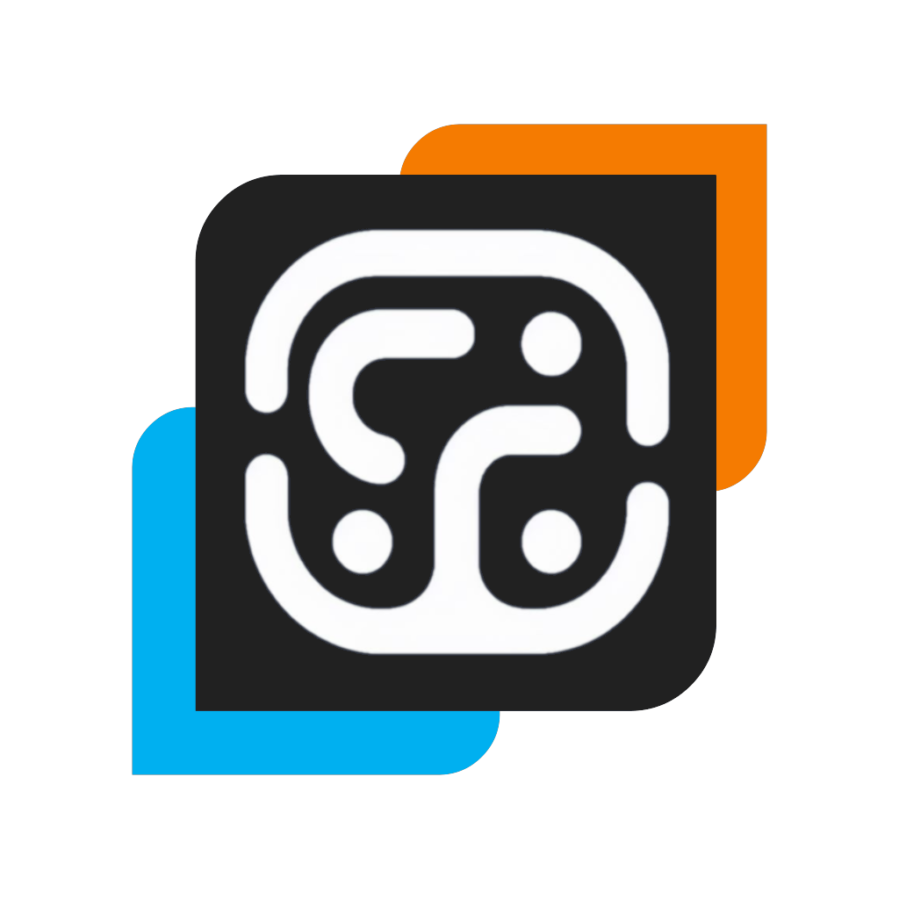

# BACflow

machine learning framework for blood alcohol content (BAC) estimation.

## 🌟 overview

**BACflow** supports the following modelling techniques:
- classical modelling methods derived from E. Widmark's mathematical framework[^1];
- non-intrusive time-series modelling methods using implicit feature fusion (i.e., inertial and biometric data)[^2].

## 📁 resources

- [BAC-simulator](https://github.com/bcyran/bac-simulator)
- [drinkR - estimate your BAC](https://www.sumsar.net/blog/2014/07/estimate-your-bac-using-drinkr/)
- [drinkR - repository](https://github.com/rasmusab/drinkr)
- [get-BAC](https://getbacsoftware.org/)
- [Michaelis–Menten kinetics](https://en.wikipedia.org/wiki/Michaelis%E2%80%93Menten_kinetics)
- [pybind11 - chat-GPT](https://chat.openai.com/share/936bbecd-8445-48eb-ba65-0e49a2e95bd0)
- [pybind11 - scikit-build](https://github.com/pybind/scikit_build_example)
- [pybind11 - setuptools](https://github.com/pybind/python_example)

## 🤝 contributing 

contributions to **BACflow** are welcome!

feel free to submit pull requests or open issues on our repository.

## 📄 license

see the [LICENSE](LICENSE) file for more details.

[^1]: [D. Posey and A. Mozayani, The Estimation of Blood Alcohol Concentration: Widmark Revisited, 2007](https://doi.org/10.1385/fsmp:3:1:33)
[^2]: [A. McAfee, J. Watson, B. Bianchi, C. Aiello and E. Agu, AlcoWear: Detecting Blood Alcohol Levels from Wearables, 2017](https://doi.org/10.1109/UIC-ATC.2017.8397486)
